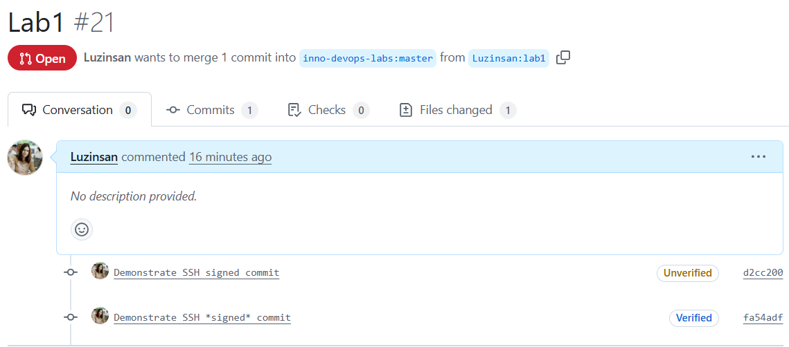
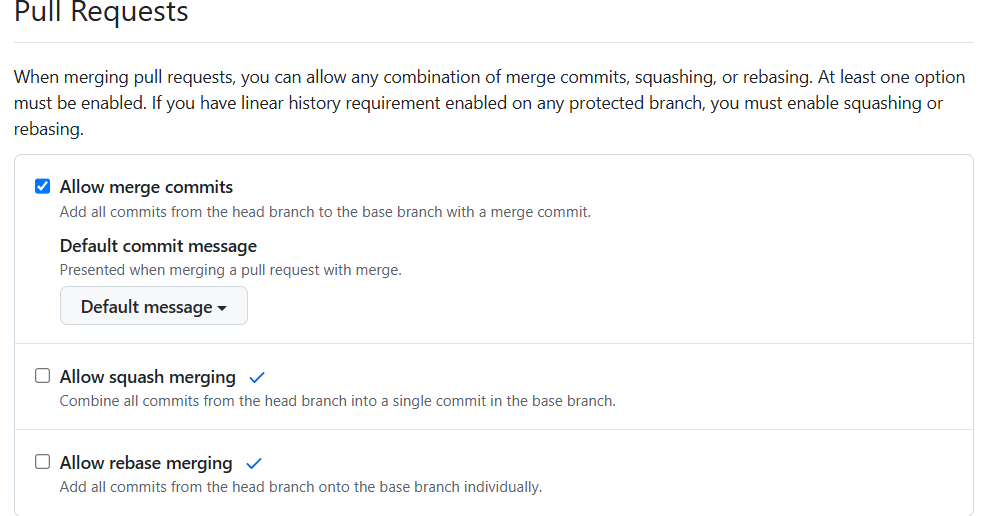

# Lab 1 Report

## Task 1: Commit Signing

1.  **Benefits of Signing Commits:**

    The primary purpose of signing commits is to verify the origin and integrity of the code changes. It acts as a digital signature, confirming that the commits were made by a verified author and have not been tampered with since they were signed. This enhances security by ensuring that only legitimate changes from trusted sources are integrated into the codebase, safeguarding the project's overall integrity.

2.  **Procedure for Making a Signed Commit:**
    *   First, SSH keys were generated using the `ed25519` algorithm:
        `ssh-keygen -t ed25519 -C "your_actual_email@example.com"`
    *   The public key was then added to the GitHub account as a signing key.
    *   Git was configured globally to use this SSH key for signing commits:
        ```bash
        git config --global user.signingkey ~/.ssh/id_ed25519.pub
        git config --global commit.gpgSign true
        git config --global gpg.format ssh
        ```
    *   A commit was then made and explicitly signed:
        `git add . && git commit -S -m "Demonstrate SSH signed commit"`
    *   Finally, the signed commit was pushed to the remote repository:
        `git push origin master`
    * Outcome: The commit appeared as "Verified" on GitHub.


## Task 2: Merge Strategies

1.  **Comparison of Git Merge Strategies:**

    *   **Merge Commit (Standard Merge):**
        This strategy integrates changes from a feature branch into the target branch by creating a new "merge commit." This special commit has two parents, linking the histories of both branches and clearly marking the integration point.
        *   **Advantages:** It's the default Git behavior and preserves the complete history of the feature branch, including all individual commits and their metadata. The project's timeline remains explicit.
        *   **Disadvantages:** It can lead to a cluttered history in the target branch with numerous merge commits, especially if many small feature branches are frequently merged.

    *   **Squash and Merge:**
        This method combines all commits from a feature branch into a single, consolidated commit. This one commit is then appended to the history of the target branch.
        *   **Advantages:** It results in a cleaner, more linear history on the target branch, as each feature is represented by a single commit. This simplifies understanding the main line of development.
        *   **Disadvantages:** The detailed history of individual commits within the feature branch is lost. This includes specific changes, authors of intermediate commits, and the step-by-step development process. Care must be taken not to re-merge the original feature branch, as this could reintroduce changes already squashed.

    *   **Rebase and Merge:**
        This strategy rewrites the feature branch's history by replaying its commits one by one on top of the latest commit of the target branch. This creates a linear history, making it appear as though the feature was developed sequentially on the target branch.
        *   **Advantages:** Produces a very clean, straight-line project history, which can be easier to follow. It's often preferred in workflows like trunk-based development.
        *   **Disadvantages:** History rewriting can be risky, especially for branches shared with others, as it changes commit IDs and can lead to confusion. If the original commits were signed, those specific signatures are lost as new commits are created (though the new rebased commits can be signed). Resolving merge conflicts can be more tedious, as conflicts might need to be addressed for each commit being rebased rather than once for the entire merge.
    * Repository Settings Modification:
    
    The repository settings on GitHub were adjusted to permit only the standard "merge commit" strategy for pull requests. Squash merging and rebase merging options were disabled.


